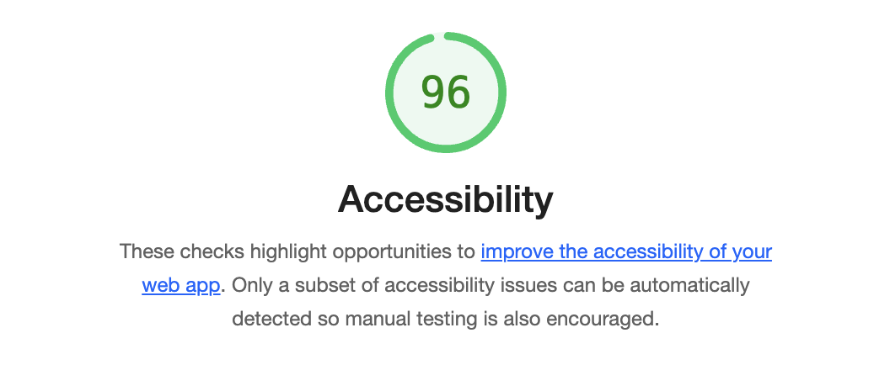

# cookie-stand

# Class Lab - 06

## Project Name: Cookie-Stand

This website is a simple online storefront that was created using JavaScript, CSS, and HTML. It serves as a basic platform for displaying and selling products.

### Author: Jennifer Sung

### Links and Resources

* [ChatGBT](https://chat.openai.com/)
* [Mdn](https://developer.mozilla.org/en-US/docs/Web/JavaScript/Reference/Global_Objects/Math/floor)

### Lighthouse Accessibility Report Score

